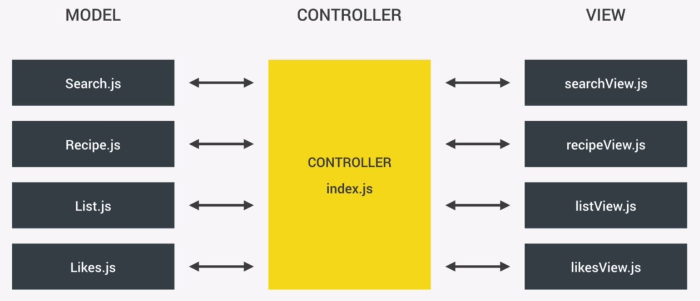

# recipe-app [ Forkify ]

API 를 이용한 레시피 정보 검색 web app  
( [JavaScript 학습]() project )

> ### Site
>
> [https://seongjin-recipe.netlify.com](https://seongjin-recipe.netlify.com)

> ### Used API
>
> [https://forkify-api.herokuapp.com](https://forkify-api.herokuapp.com)

> ### Reference
>
> - 코드스타일링을 위해 [ESLint](https://eslint.org/) ([Airbnb style guide](https://github.com/airbnb/javascript)) 와 [Prettier](https://prettier.io/docs/en/install.html)를 사용  
>   (eslint, prettier [참고] https://velog.io/@velopert/eslint-and-prettier-in-react)

- ### Architecture

  </img>

- ### Memo

  - #### Array 관련

    > - Array.reduce() : [searchView.js]() > [[MDN >>]](https://developer.mozilla.org/ko/docs/Web/JavaScript/Reference/Global_Objects/Array/Reduce)  
    >   (요소를 건너뛸 때 사용하기 좋음)
    > - Array.join() : [searchView.js]()
    > - Array.findIndex(callback fn) : callback 을 true return 하는 첫 번째 요소의 idx return [Recipe.js]()
    > - Array.include() : [Recipe.js]()
    > - Array.map()
    > - Array.from(array-like object) : [searchView.js]()
    > - Array.slice(시작 idx, 끝 idx) : 배열 분리하여 새 배열 생성 [Recipe.js]()
    >   > slice 와 splice 비교 [List.js]()

* #### Object 관련

  > - property 를 변수로 선언하기 [Recipe.js]()
  >
  >   ```
  >      object{
  >          변수명
  >      }
  >      ==>  {변수명 : 변수의 값} 으로 자동 저장됨
  >   ```

  > - Global State Object 사용법 [index.js]()

* #### HTML 관련

  > - ##### DOM 제거하는 법
  >   - loader.parentElement.removeChild(loader)  
  >     : 부모 요소를 먼저 찾은 후 .removeChild(element) 로 해당 el만 제거
  >   - EL.innerHTML = ' '  
  >     : 요소에 관계 없이 EL 안의 모든 HTML 을 삭제한다.
  > - ##### html5 'data-\*' 속성 사용법 [searchView.js]()
  >   - html: \<button class="btn1" data-xx=2>
  >   - js: btn1.dataset.xx // = 2
  >   - selector : document.querySelector("[data-xx=2]");
  > - ##### html tag 의 attribute 조작 [likesView.js]()
  >   - 요소.setAttribute('속성명', '값');
  > - ##### 속성 값으로 선택자(selector) 이용하기 [likesView.js]()
  >   - document.querySelector(`.likes__link[href*="10"]`)  
  >     : 해당 클래스 요소 중 href 가 10 인 모든 요소

* #### Event 관련

  > - ##### event.preventDefault() : [index.js]()
  > - ##### hash change event [>>]()
  >   > url 에서 # 부분 값의 변화를 감지함  
  >   > window.addEventListener('hashchange', callback fn)
  > - ##### load event [>>]()
  >   > page 가 load 되는 것을 감지함  
  >   > window.addEventListener('load', callback fn)
  > - ##### event.target.closest('selector') 사용법 [index.js]()
  >   : event target 에서 가장 가까운 'selector' 요소를 return (부모 자식 간에만 서치함)
  > - ##### event.target.matches('selector') 사용법 [index.js]()
  >   : target 이 지정된 요소와 동일한지 확인 후 boolean return

* #### Package 관련

  > - ##### fractional 사용법 [>>]()
  > - ##### uuid 사용법 [>>]()
